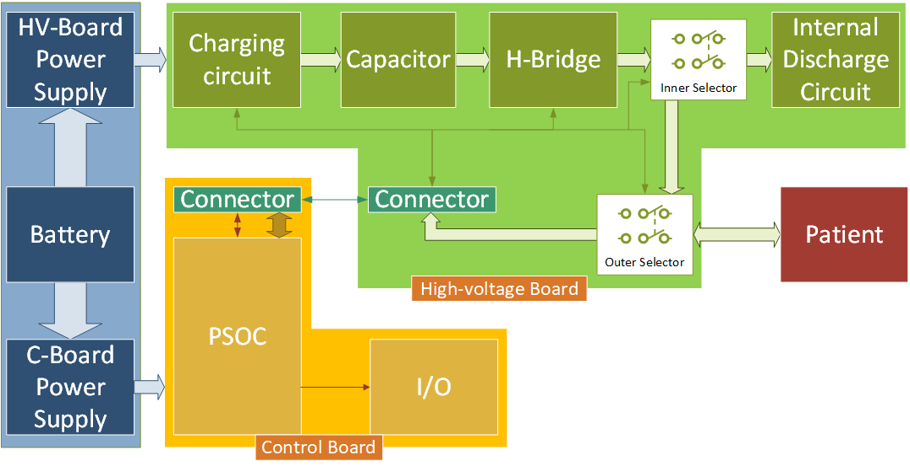
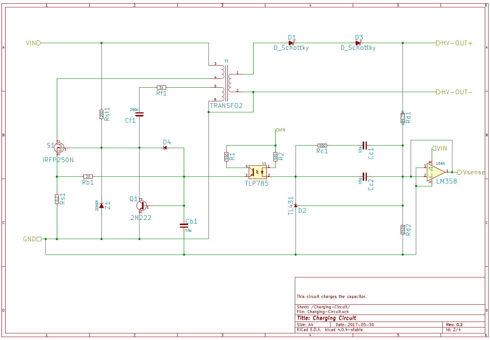
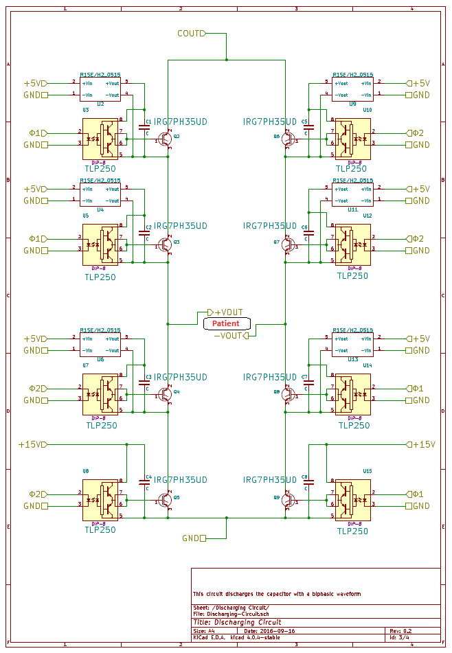
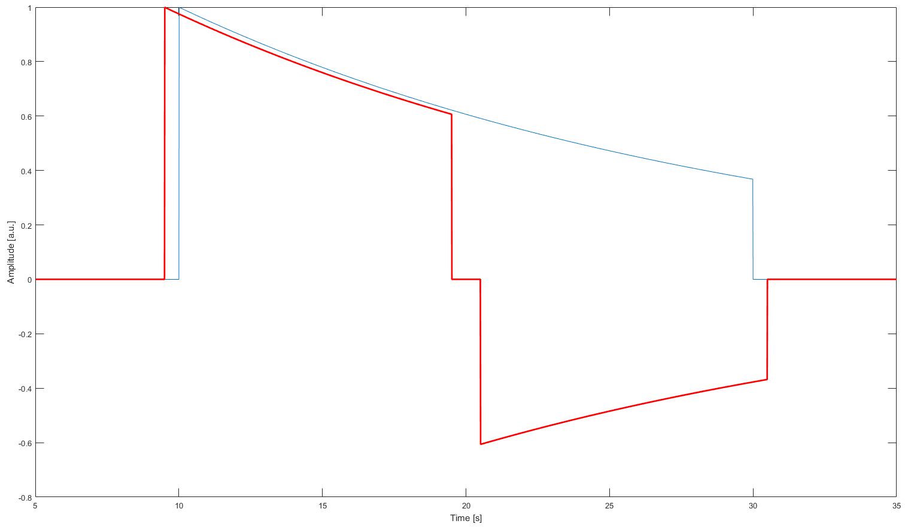
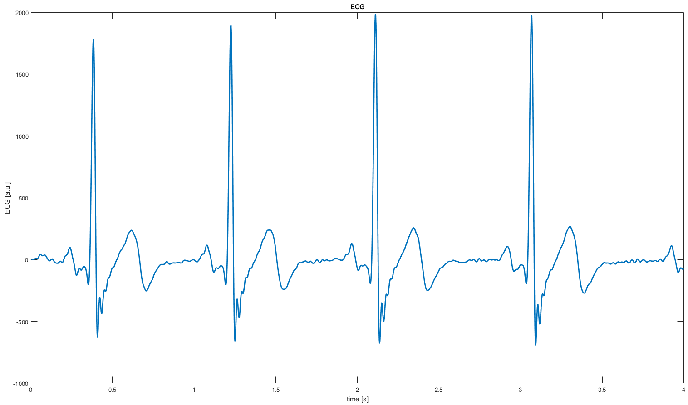
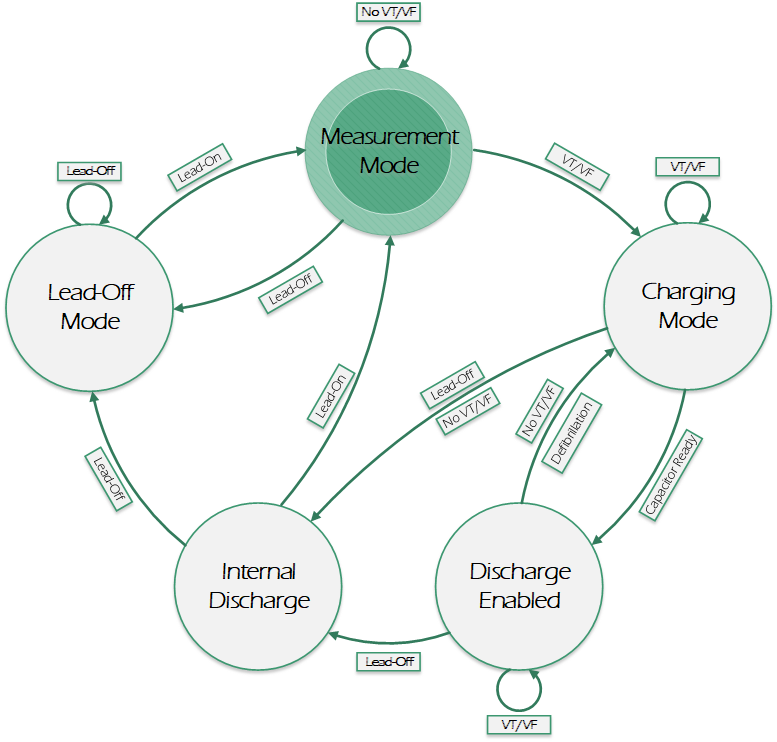

# Open-source Automated External Defibrillator (OAED)
The subject presented in this work has been developed in the framework of [UBORA](http://ubora-biomedical.org), a project funded by the European Union, aims at developing a Europe-Africa e-infrastructure for open-source co-design of new solutions to face the current and future healthcare challenges of Europe and Africa.

## Abstract
Automated External Defibrillator (AED) is a medical device that analyzes a patient’s Electrocardiogram (ECG) in order to establish whether he/she is suffering from the fatal condition of Sudden Cardiac Arrest (SCA), and subsequently allows the release of a therapeutic dose of electrical energy (i.e. defibrillation). SCA is responsible for over 300'000 deaths per year both in Europe and in USA, and immediate clinical assistance through defibrillation is fundamental for recovery. In this context, an open-source approach can easily lead to improve the distribution and efficiency of AEDs. The proposed Open Source AED (OAED) is composed of two separate electric boards: a high voltage board (HV-B), which contains the circuitry required to perform defibrillation and a control board (C-B), which verifies SCA in the patient and controls the HV-B. Computer simulations and preliminary tests show that the OAED can release a 200 J biphasic defibrillation in about 12 seconds and recognizes SCA with sensitivity higher than 90% and specificity of about 99%. The OAED was also conceived as a template and teaching tool in the framework of UBORA, a platform for design and sharing medical devices compliant to international standards.

---

## Introduction
An Automated External Defibrillator (AED) is a portable electronic medical device capable to automatically diagnose whether a patient is suffering from Sudden Cardiac Arrest (SCA), and allows treating him/her through defibrillation when needed.

In case of SCA, the heart suddenly and unexpectedly stops beating in an ordered form, and it starts a chaotic behaviour. When this happens, blood stops flowing to the brain and other vital organs. In these conditions, the patient can be considered dead, and he will remain in this state unless someone helps him immediately by “resetting” the heart. The most effective way to treat a Sudden Cardiac Arrest is with defibrillation, namely a therapeutic dose of electrical energy. The necessity of performing defibrillation as soon as possible has led to the development of AEDs.

The peculiarity of these devices is that they have been designed to be used with few or no medical knowledge, allowing a capillary diffusion for reducing SCA victims. The open source approach would help this diffusion, with the additional advantage of offering a chance to improve the existing designs. However, although AEDs existed for over twenty years, there are currently no open source designs.

---

## Design

OAED was designed keeping in mind: a) compliance with the regulatory standards required to obtain the CE marking, with special regards to IEC 60601-1 and IEC 60601-2-4; b) the necessity of using it as a teaching instrument; c) the low costs required for a greater distribution; and d) competitiveness with the existing devices, in terms of efficiency, reliability, and safety.

As shown in Figure 1, OAED is divided in two main electric boards powered by a battery: the High-Voltage Board (HV-B), and the Control Board (C-B).

Figure 1: OAED block diagram.

The first contains all the circuitry necessary to perform defibrillation, including: a capacitor that store the energy to release; a charging circuit, which rapidly charges the capacitor; an H-Bridge circuit, required to perform biphasic defibrillations; an internal discharge circuit, used to dump unused energy; and two selectors, used to isolate the patient from the capacitor, and to route the ECG signal to the C-B.

From an engineering point of view, defibrillation can be approximated with the discharge of a capacitor on a pure resistive load. Defibrillation can be schematized with a RC circuit, where the patient is represented as a resistor, while a capacitor represents the defibrillator. For this reason one of the most critical aspect of an AED is the charging time of the capacitor, because more than one charge-discharge cycles is usually needed to save a life.

For the charging circuit of OAED, Imodified a flyback converter to obtain a custom Ringing Choke Converter (RCC) visible in Figure 2. The numerical simulations made with LTspice shown that the RCC I designed is capable of efficiently charging the  capacitor to a nominal voltage V0 of 1700V in under 6 seconds.

Figure 2: OAED Charging Circuit - Ringing Choke Converter.

The second critical circuit in OAED HV-B is the H-Bridge, showed in Figure 3. Although the H-Bridge is a well-known circuit, it required some special attention to handle rapid current changes at high voltages. Every switch of the classic H-Bridge design has been implemented with two IGBTs in order to achieve high safety and performances, and at the same time keep the costs low.

Figure 3: OAED H-Bridge.

The H-Bridge circuit makes it possible the control polarities of defibrillation discharges, allowing to release biphasic defibrillations (Figure 4), which grants higher resuscitation chances even at lower energies.

Figure 4: Biphasic defibrillation (red) vs monophasic defibrillation (blue).

The C-B instead, can be seen as the device *brain*. It contains a Programmable System on Chip ([PSoC](http://www.cypress.com/products/32-bit-arm-cortex-m3-psoc-5lp)), which -amongst other functions- integrates the analogical front-end used to acquire the ECG and impedance from the patient. The PSoC also contains an ARM Cortex-M3 CPU, used to analyse the signals and assert the defibrillation needs.

Since the main focus of AEDs is ease of use, only one couple of electrodes can be applied on the patient. Thereafter ECG and impedance acquisitions share the same electrodes. Impedance measurement is a very critical aspect in AEDs, because it is used to assert if a patient is connected to the device, and to calculate the discharge time required to release into him a precise amount of energy.

The acquisition chain includes a buffered -ADC that samples the patient signal at a sampling frequency of 4000 sps, with a 16 bit resolution. The signal is collected by three different DMAs: one for the ECG, one for impedance, and one for the raw signal -which is mostly used for debug purpose. The ECG and impedance signals are digitally filtered in the PSoC Digital Filter Block and then sent into the SRAM. Once there, the ECG is decimated to match a sampling frequency of 500 sps, and stored in 4 seconds arrays (Figure 5).

Figure 5: ECG signal obtained via OAED.

The PSoC has been programmed with a specific firmware that acts as a finite-state machine (Figure 6) in which each state depends on the occurrence of specific events. When entering a state, the firmware enable or disable certain circuits, depending on the state itself.

Figure 6: OAED finite-state machine diagram.

Moreover, the firmware also integrates five different algorithms used for SCA diagnosis: Threshold Crossing Intervals, VF filter, Threshold Crossing Sample Count, Phase Space Reconstruction, and Hilbert Transform algorithm. Each 4 seconds ECG segment is analysed with all five algorithms, and recognition of SCA is based on the majority.

Preliminary tests using PhisioNet data showed that the combined algorithms have a specificity over 99%, and a sensibility higher than 90%.

---

## Conclusions
Albeit tests are needed for the experimental validation of HV-B, OAED design is compliant with the standards defined by the IEC 60601. For this reason, OAED has been used as a template for the development of the UBORA platform, an e-infrastructure for design new open devices compliant with MDD 93/42 and ISO standards, in the framework of a joint EU funded project between Europe and Africa.

## Credits
The content of this repository was developed by Jacopo Ferretti as part of his [thesis](./Thesis.pdf) work to achieve the Master degree in Biomedical Engineering.
